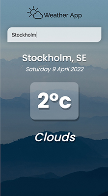

# Weather App

A simple weather app built with Vue.js that fetches weather from Open Weather Map.

 

## Project Setup
### Clone and install
```sh
git clone https://github.com/malin-nilsson/WeatherApp
```

```sh
npm install
```

### Compile and Hot-Reload for Development

```sh
npm run dev
```

### Compile and Minify for Production

```sh
npm run build
```

### Acknowledgments
Images: <br />
Wes Hicks - https://unsplash.com/photos/G2W_8eagxNQ <br />
Alessio Soggetti - https://unsplash.com/photos/PdGBci-4jR8
