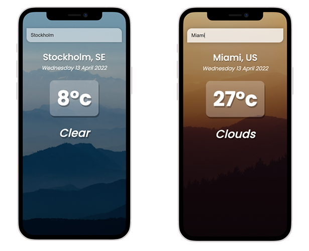

# weather-app

A simple weather app built with Vue.js that fetches weather from Open Weather Map. 

This was my first time building a project using Vue and I'm obsessed with it now. I chose to use the options API because the syntax looked a bit simpler as a beginner. For my next Vue project, I plan on trying out the composition API.




## Project Setup
### Clone and install
```sh
git clone https://github.com/malin-nilsson/WeatherApp
```
npm install
```

### Compiles and hot-reloads for development
```
npm run serve
```

### Compiles and minifies for production
```
npm run build
```

<<<<<<< HEAD
### Lints and fixes files
```
npm run lint
```

### Customize configuration
See [Configuration Reference](https://cli.vuejs.org/config/).
=======
### Acknowledgments
Images: <br />
Wes Hicks - https://unsplash.com/photos/G2W_8eagxNQ <br />
Alessio Soggetti - https://unsplash.com/photos/PdGBci-4jR8
>>>>>>> 2c51025b858930395ae5b19e6983852b55256cb4
